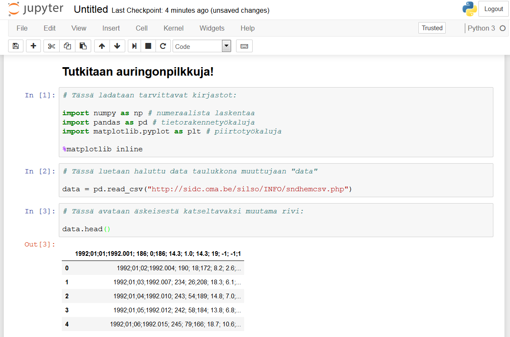
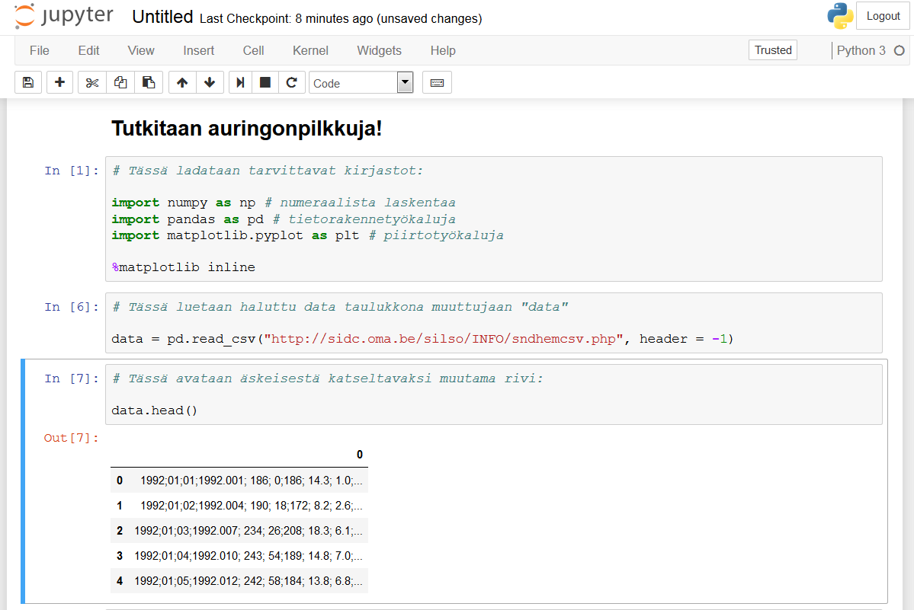
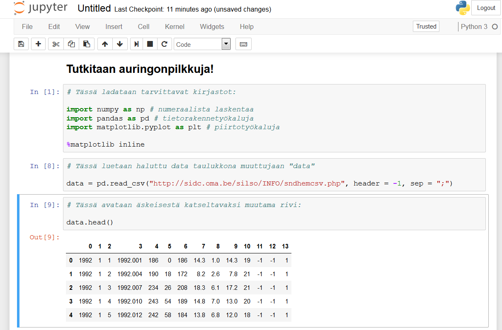
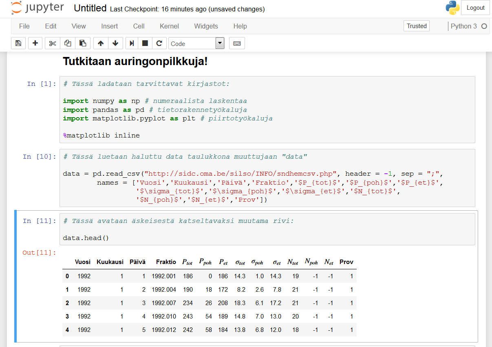
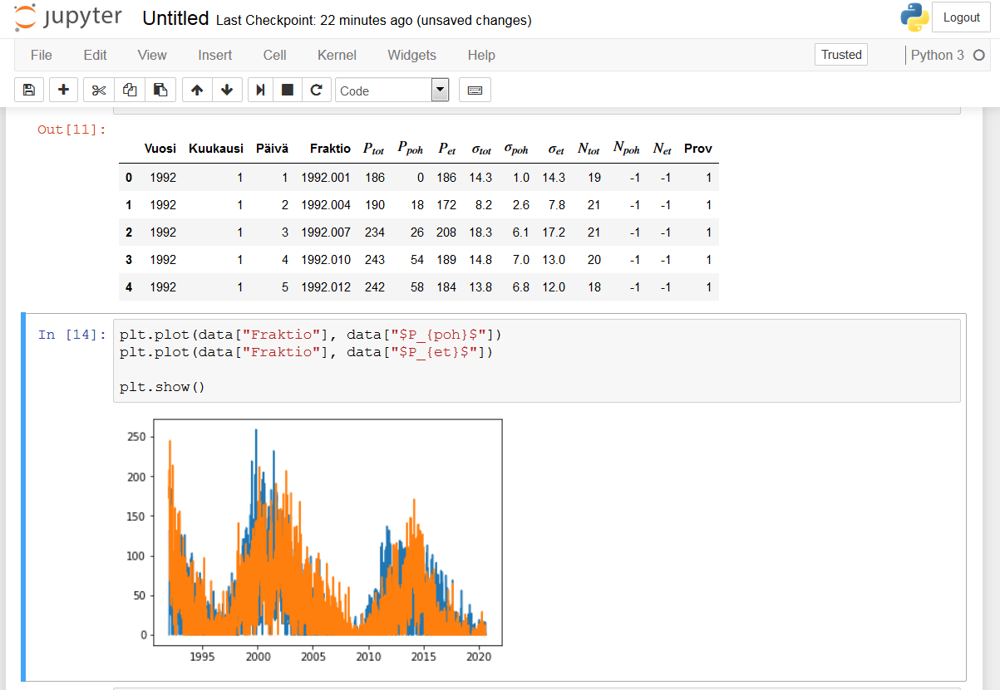
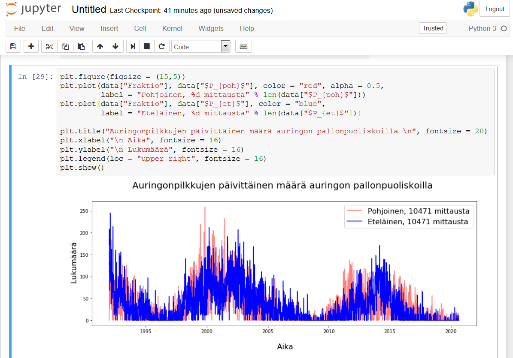

## Esimerkkitapaus datan lataamisesta ja käsittelystä

Tehdään helppo esimerkki!

- Etsitään aineistoa, kuten vaikka aikasarja auringonpilkuista [SIDC:n sivuilta](http://sidc.oma.be/silso/datafiles).
- Tehdään muistio joka pystyy avaamaan sen:

- Lukeminen näyttää alkaneen huonosta kohtaa, käsketääs tulokseen mukaan otsikkorivi:

- No ei nyt ihan mennyt putkeen tämäkään, mutta huomaamme että syynähän on huonosti muotoiltu taulukko. Oletuserotin pd.read_csv() -komennolle on pilkku, mutta datassa näkyy puolipisteitä. Korjataan parametrilla "sep":

- Parempi. Nyt voi tietysti ihmetellä saisiko sarakkeet nimettyä paremmin, jos katsoo mitä kukin tarkoittaa (selitys SIDC:n sivuilla). Käytetään "names"-parametria latauksen yhteydessä. Voisi nämä nimetä muuttujassakin, mutta samalla vaivalla se pienillä tiedostoilla menee tässäkin.

- No johan alkaa näyttää ymmärrettävältä informaatiolta! Otetaan nopea kuvaaja pohjoisen ja eteläisen auringonpuoliskon pilkkuluvuista:

- Hahaa, voiton puolella. Tehdään vielä joukko muotoilutoimenpiteitä paremman esityksen nimissä:

Ja siinä se sitten onkin. Haettiin dataa, katsottiin millaista se on, muotoiltiin se nätimmäksi ja esitettiin se kivana visualisaationa josta voidaan ryhtyä pureutumaan vaikka auringon monivuotisiin sykleihin tai jatkaa tarkemmin itse datan kanssa (selvitetään vaikka keskimääräiset päivittäiset pilkkumäärät ja niiden vuosittaiset vaihtelut).

Kokeile itse samaa luomalla uusi muistio ja etsimällä kiintoisa datasetti (tai kopsaa osoite yltä)!

