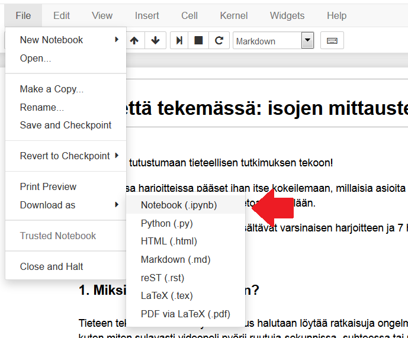

# Muistion tallentaminen

MyBinderissa työtila katoaa kokonaan käytön lopuksi, joten kaikki tulokset kannattaa ottaa talteen, jos niitä haluaa käyttää myöhemmin. MyBinderissa *File -> Download as* -valikosta löytää joukon tallentamisvaihtoehtoja. Jos haluat jatkaa muokkaamista myöhemmin, tallenna .ipynb-muodossa (notebook-tiedosto). Opiskelijoiden tuotoksia arvioidessa voi olla hyvä ottaa palautuksia vastaan esimerkiksi HTML- tai PDF-tiedostoina joita on helppoa lukea. 

Tallentaminen onnistuu vaikka MyBinder olisi katkaissutkin yhteyden. MyBinderissa on pari elämää helpottavaa nappia, joilla voi ladata muistionsa nykyisen tilan selaimen välimuistiin ja palauttaa sen sieltä uudelleenkäynnistyksen jälkeen! 

1. Kun huomaat yhteyden katkenneen, tallenna nykytilasi selaimeen.
1. Käynnistä Binder-sessio uudelleen.
1. Avaa sama muistio kuin aiemmin.
1. Paina palautusnappia.
1. Tadaa! Tarkempia tietoja ja yllä oleva gif [täältä](https://discourse.jupyter.org/t/getting-your-notebook-after-your-binder-has-stopped/3268)
