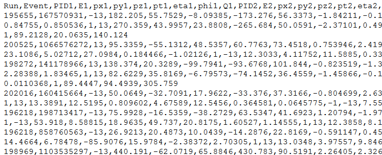

## Tiedostomuodoista

Jokainen tietokoneiden kanssa toiminut tietää, että informaatiota voidaan siirtää ja esittää useissa muodoissa. Lyhenteet kuten pdf, txt, ppt, rtf, jpg ja monet muut vilisevät niin arkisessa kuin ammatillisessakin käytössä. Kullakin näistä on oma tarkoituksensa, mutta samalla se estää niiden käyttöä toisissa yhteyksissä ilman muodon vaihtoa.

Ohjelmointia varten kannattaa suosia simppeleitä lista- tai taulukkomuotoisia tiedostoja, jotka ovat ns. koneluettavia. Esimerkiksi pdf-tiedostot sopivat hyvin ihmissilmille, mutta tietokoneet suosivat csv:n (comma separated values, pilkulla erotellut arvot) kaltaisia tekstilistauksia ja moni dataa jakava lähde jakaakin tietojaan näissä muodoissa. Vähäisen graafisen informaationsa vuoksi ne ovat usein myös tietokoneen muistin kannalta kevyitä ja kykenevät sisältämään suuria määriä dataa. Tällä sivulla käsitellyt harjoitteet käyttävät ensisijaisesti csv-tiedostoja.

Pilkun sijaan tiedostossa voitaisiin käyttää erottimena sarkainta, puolipistettä tai muita symboleja. Joskus tiedoston lukeminen ohjelmaan ei onnistu, koska erotusmerkki on väärä. Tämä on useimmiten helppoa korjata tarkistamalla mitä merkkiä on käytetty ja vaihtamalla funktion erotusparametri vastaavaksi. Esimerkiksi Python 3 -kielessä pandas.read_cvs -komennon oletusasetus on sep = ",", minkä voisi vaihtaa vaikkapa muotoon sep = ";" jos kyseessä olisikin puolipiste. Tarkempi listaus löytyy komennon [dokumentaatiosta.](https://pandas.pydata.org/pandas-docs/stable/reference/api/pandas.read_csv.html)

Yllä näkyviä parametrejä ei tarvitse yleensä käsitellä tai edes nähdä koodaillessaan, mutta niitä voi halutessaan kutsua ja muokata.

Toinen yleinen kompastuskivi on se, millä merkistöllä tiedot on koodattu. Tämä määrittää miten bittijonot tulkataan kirjaimiksi tai merkeiksi ja vaihtelee alueittain ympäri maapalloa. Suomessa käytetään yleensä joko yleistä utf8-systeemiä tai pohjoismaista ISO-8859 -merkistöä. Täyden listan standardimerkistöistä löydät [dokumentoituna täältä.](https://docs.python.org/3/library/codecs.html#standard-encodings)

