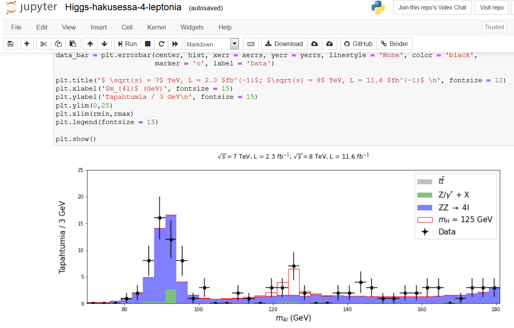
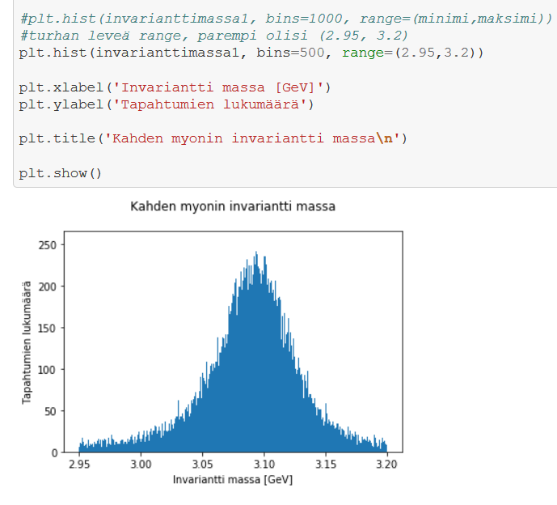
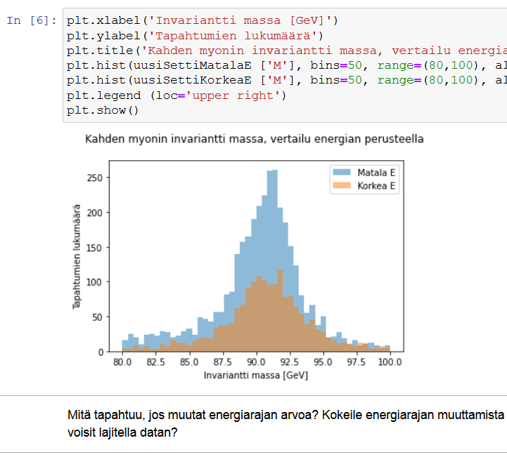

## CMS och OpenData

CMS-experimentet i CERN (CMS: Compact Muon Solenoid; CERN: Conseil Européen pour la Recherche Nucléaire) är ett av världens största offentliga experiment. Där samlar man många olika typer av data för att svara på partikelfysikens brännande frågor. CMS-kollaborationen har i flera år publicerat sina upptäckter i forsknings- och undervisningssyfte. ([Open Data Portal](http://opendata.cern.ch/search?page=1&size=20&experiment=CMS)).

Utöver råa vetenskapliga data finns här också datasets utvalda och utformade för undervisning, som är lika omfattande, men lite mer lätthanterliga. De passar således för mindre erfarna användare också. De här materialen kan undersökas som textfil eller med hjälp av excel, men vi i CMS Open Data Education -teamet är medvetna om nyttan och möjligheterna som autentiskt programmeringsarbete ger. Därför har vi också gjort Python-baserade övningar, med vilka man tillsammans med eleverna kan få en inblick i vad fysiker eller data-analytiker arbetar med nuförtiden.

Vår [materialbank](https://github.com/cms-opendata-education/cms-jupyter-materials-finnish/tree/master) hittas på GitHub, och erbjuder inspiration för lärare till att skapa eget undervisningsmaterial, och innehåller också följande möjligheter:

**Jakten på Higgs** 

**Sökandet efter en partikel i två myoners spektra**   

**Dissektion av data och begränsningskriterier**  

Om du vill bli inkastad direkt, sök dig mot [Työkalut tutuksi -sidan](https://github.com/cms-opendata-education/cms-jupyter-materials-finnish/tree/master/TyokalutTutuiksi).

Om du söker modeller för undervisningshelheter, ta en titt [här](https://github.com/cms-opendata-education/cms-jupyter-materials-finnish/tree/master/Opetusmateriaalit).

Om du vill testa mer självstående exempel för workshop-sysselsättning, ta en titt på våra [demon](https://github.com/cms-opendata-education/cms-jupyter-materials-finnish/tree/master/Demot).

