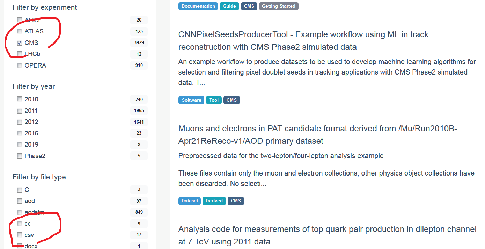
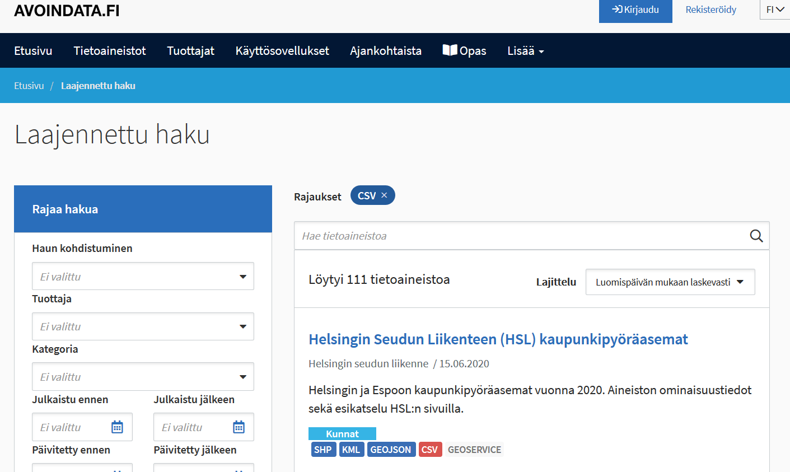
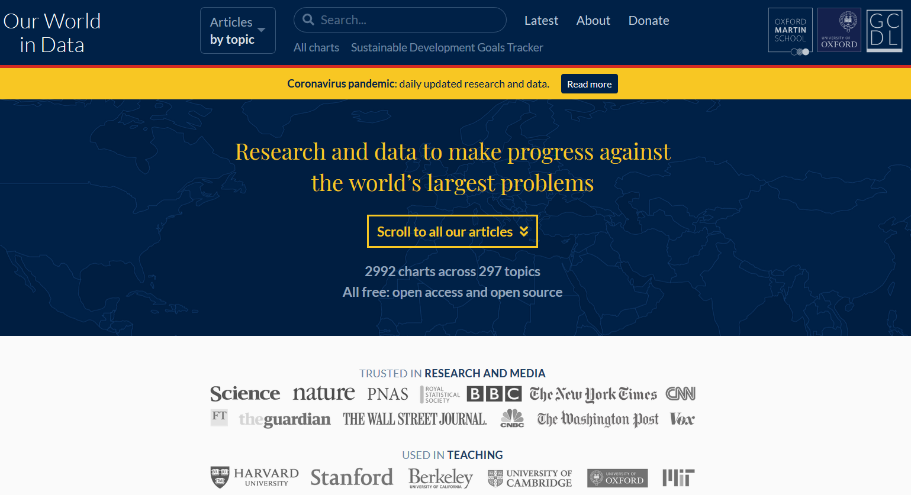

## Att hitta datafiler

Internet dignar av användbara data, men att hitta det man söker kan innebära mycket sökande och krångel med filformat. Om man googlar "öppna data", "avoin data", "open data", open data portal" eller liknande så kommer man igång. Om eleverna söker sina egna datasets att undersöka så kan det vara bra att samtidigt gå igenom vikten av källkritik. Hur tillförlitlig är infromationen från olika institut eller stater? Är den ärligt och neutralt presenterad, eller utvald för att stöda en viss agenda?

Här är några bra ställen för att hitta data:

**CERN Open Data Portal**
[http://opendata.cern.ch/](http://opendata.cern.ch/)

Här finns stora mängder av datasets för forskning och undervisning. Med hjälp av sökverktyget kan du enkelt välja t.ex. mätstationen och filformatet att ta data ifrån.

**Avoindata.fi**
[https://www.avoindata.fi/sv](https://www.avoindata.fi/sv)

En inhemsk bank för samhälleliga data. Luftkvalitetsmätningar i städerna, stadscyklarnas resedata, namnuppgifter, fordonsregister...

**Our World in Data**
[https://ourworldindata.org/](https://ourworldindata.org/)

En stor databank innehållande grafer och data för alla möjliga ändamål. Ofta använd av finsa nyhetskanaler.

**Open Power System Data**
[https://open-power-system-data.org/](https://open-power-system-data.org/)

Data gällande elnät och energiförbrukning i Europa

**Solar Influence Data Center**
[http://sidc.oma.be/silso/datafiles](http://sidc.oma.be/silso/datafiles)

Långtida data över solens aktivitet. Informationen om solfläckar sträcker sig tillbaka till 1700-t

**USGS Earthquake Hazards**
[https://earthquake.usgs.gov/earthquakes/feed/](https://earthquake.usgs.gov/earthquakes/feed/)

Ständigt uppdaterad data angående världens jordbävningar. Tillgängligt även som csv (spreadsheets).

**Awesome Public Datasets**
[https://github.com/awesomedata/awesome-public-datasets](https://github.com/awesomedata/awesome-public-datasets)

En stor samling datafiler med blandat tema. Allt från dataspel till bankdata.
