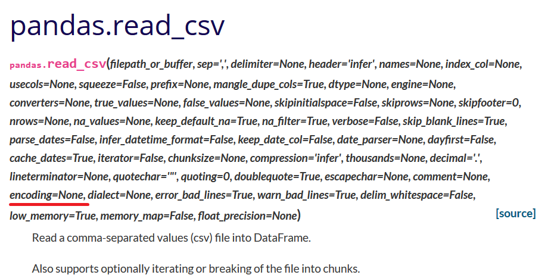

## Filformat

Var och en som har jobbat med dator vet att information kan flyttas och visas i olika former. Förkortningar som pdf, txt, ppt, rtf, jpg och många andra visar sig i både vardagligt och professionellt bruk. De har alla sina egenskaper och betydelser, och ibland måste man ändra filens format för att kunna använda den i ett visst program.

För programmering ör det lönsamt att hålla sig till enkla list- eller tabellbaserade format, som är maskinläsliga. Exempelvis pdf-filer lämpar sig bra för människoögon, men datorer föredrar csv(comma separated values)-format, och många källor som delar data använder just precis det formatet. Eftersom de är visuellt sparsamma filer är de också lätta för datorn att behandla trots att de kan innehålla stora mängder data. Övningarna som vi behandlar på den här sidan använder främst csv-filer.

### Separatorer

Istället för kommatecken kan kan man använda tab, semikolon eller andra tecken. Om vi använder en sådan fil i Python måste vi ändra på parametrarna i **pd.read**-funktionen så att den tolkas rätt. Man kan lägga till parametern **sep = ";"** för att åtgärda det problemet. En mer ingående lista över parametrar hittas i **pandas**-paketets [dokumentation.](https://pandas.pydata.org/pandas-docs/stable/reference/api/pandas.read_csv.html)

Parametrarna ovan behöver vanligen inte ändras eller ens skrivas ut i koden. Oftast duger grundinställningarna.

### Teckenpaket

Ett annat vanligt hinder är det, att informationen kan vara skriven i ett annat teckenpaket. Teckenpaketet avgör hur bitserier tolkas till bokstäver och tecken, och varierar områdesvis världen över. I Finland använder vi vanligen något allmänt utf8-system eller Nordens ISO-8859 -tecken. En fullständig lista över standardteckenpaket hittas [här](https://docs.python.org/3/library/codecs.html#standard-encodings). 

