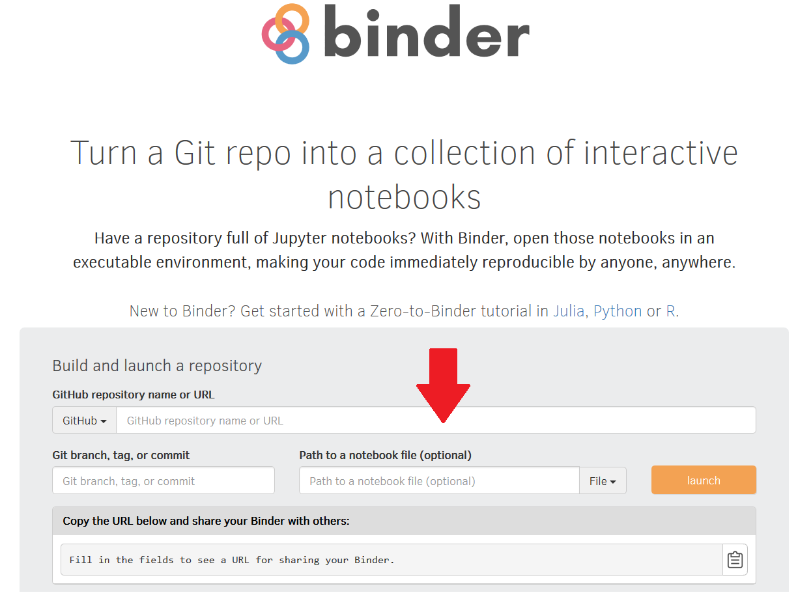
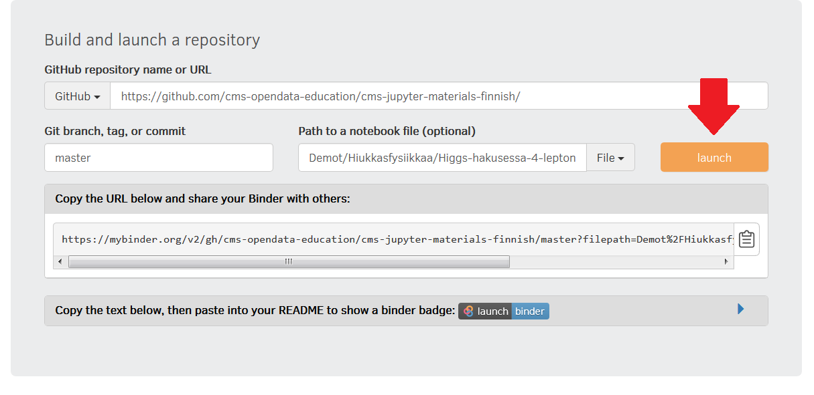
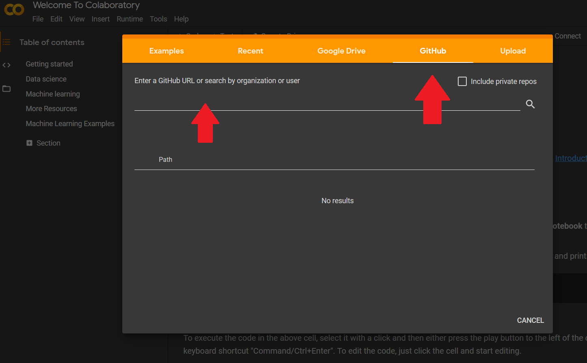
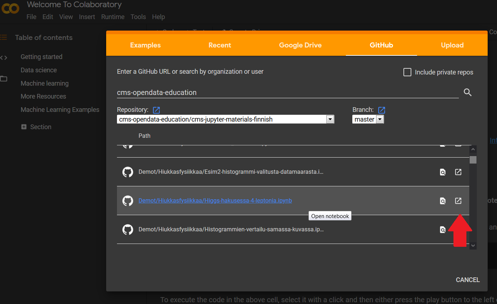
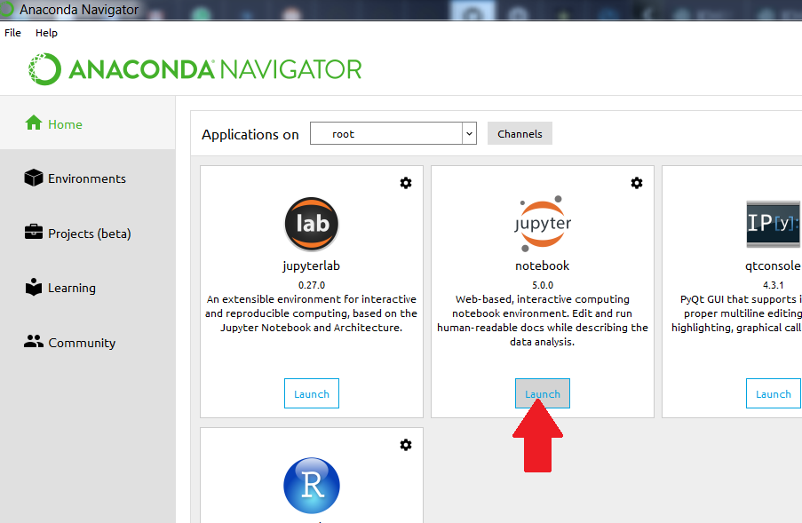
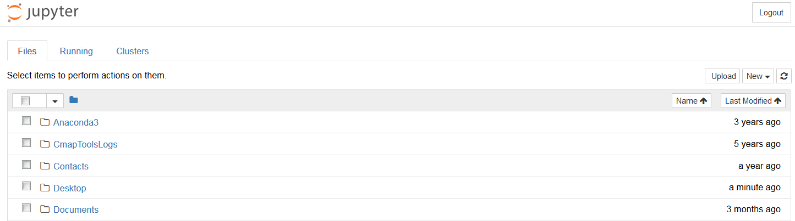
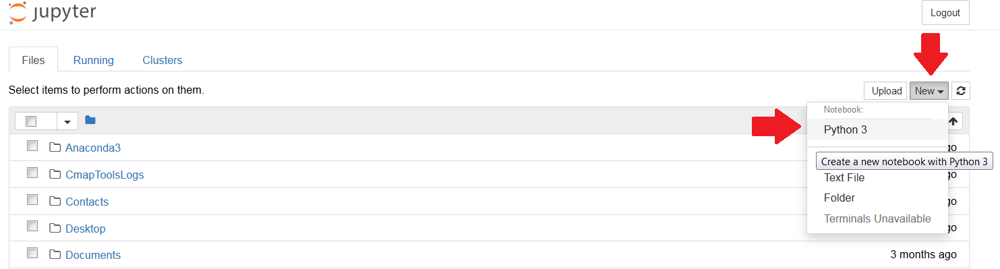

## Hur man öppnar en Jupyter Notebook

 Jupyter Notebooks kan hanteras antingen lokalt på din egen dator eller online genom en browser.

 Om du använder en Notebook i browsern krävs ingen installation eller nedladdning, och du kan få tag på ditt material på bara ett par minuter, 
men det här kräver en kontinuerlig nätförbindelse och är oftast tidsbundet. (MyBinder, t.ex, kopplar bort användaren om inga ändringar görs på tio minuter). 
Browserversionen lämpar sig för korta demonstrationer eller workshop-tillfällen, men för längre projekt lönar det sig att ladda ned de behövliga applikationerna.

### 1. Korta instruktioner för browseranvändning:

#### MyBinder

I Sök upp en lämplig Notebook eller GitHub-repositorium, t.ex. [https://github.com/cms-opendata-education/cms-jupyter-materials-finnish/blob/master/Demot/Hiukkasfysiikkaa/Higgs-hakusessa-4-leptonia.ipynb](https://github.com/cms-opendata-education/cms-jupyter-materials-finnish/blob/master/Demot/Hiukkasfysiikkaa/Higgs-hakusessa-4-leptonia.ipynb)

II Öppna [MyBinder](https://mybinder.org), som skapar en virtuell verkstad. Sidan ser ut ungefär såhär:

III Kopiera adressen från steg I i fältet, antingen bara [https://github.com/cms-opendata-education/cms-jupyter-materials-finnish](https://github.com/cms-opendata-education/cms-jupyter-materials-finnish) (Detta öppnar upp hela repositoriet och du kan söka fram den fil du behöver) eller tillsammans med filens sökväg som på bilden nedan, så öppnas filen direkt:

 

IV Tryck "launch" och vänta en stund. Det kan ta någon minut.

V Sätt igång! Om du undrar hur man använder Jupyter hittas guider för det också på denna hemsida.

VI Om materialet ska användas i grupp, lägg märke till länken som finns i rutan längst ned på binder-sidan. Den är en direktdelningslänk som går lätt att sätta ut i ett mail eller på en hemsida så att eleverna kan skrida till verket med ett enda klick. Det ovan nämnda materialet kan t.ex. öppnas med HTML-knappen nedan: 

#### Google Colab

I Sök upp ett lämpligt material, vi använder samma som ovan för exemplets skull.

II öppna [Colab](https://colab.research.google.com/notebooks/intro.ipynb).

III Tryck "Open Notebook" i "File"-menyn uppe till vänster

IV Öppna "GitHub"-fliken och sök det repositorium du önskar.

V Leta i listan efter den mapp du vill öppna och tryck på öppningsknappen till höger: 

VI Sätt igång!
  
VII Precis som med Binder, låter också Colab dig dela direktlänkar:

### 2. Så här får du Jupyter att fungera på din egen dator:

#### Ladda ned material

I Om du vill använda bitar av vår materialbank på din egen dator, måste du först ladda ned dem från vår [GitHub-sida](https://github.com/cms-opendata-education/cms-jupyter-materials-finnish). 
Du kan ladda ned hela innehållet på en gång som en zip-fil genom att klicka på "Code" och välja "Download ZIP":

II Extrahera zip-filen i valfri mapp på din dator.

#### Användning av material

I Installera ett passande program, exempelvis [Jupyter Notebook](https://jupyter.org/) eller något bredare datateknikpaket så som [Anaconda](https://www.anaconda.com/products/individual), där Jupyter Notebook finns inkluderat.

II Öppna programmet (Om du har Anaconda kan du söka upp och öppna "Anaconda Navigator" på din dator)

III Välj "Jupyter Notebook", som öppnar ett lokalt mappsystem som visas i din browser.

IV Sök bland dina mappar efter det material du vill öppna och sätt igång! 

V Om du vill göra fler filer elle mappar, navigera dig fram till den mappen där du vill skapa något nytt och välj "New"

