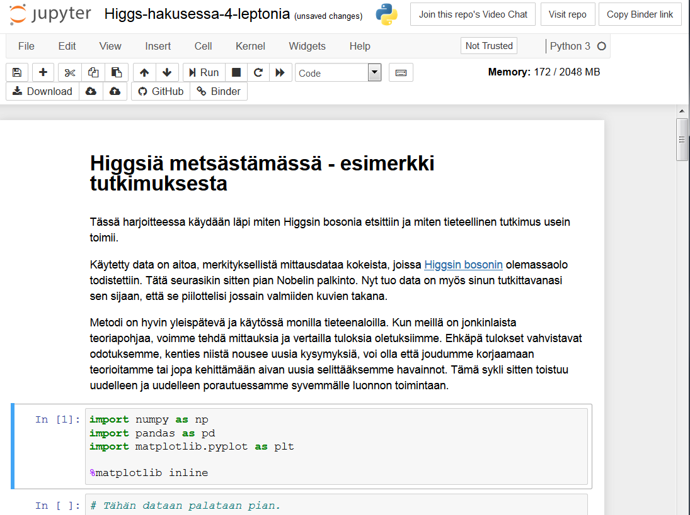

## ..Översättning pågår.. Att ändra en fil i Jupyter Notebook

Notebooks är användarvänliga verktyg: I grunden består de av celler, som kan bestå antingen av text ("markdown-celler") eller kod. Genom att lägga till nya eller ändra befintliga celler kan du skriva en egen analys för de givna materialen.

Jupyter Notebooks kan se ut så här:

Genom att dubbelklicka celler får man ändra dem, och man kan köra deras kod genom att trycka på **"Run"**-knappen bland verktygen eller använda snabbkommandot **Ctrl+Enter**
När du har valt en cell är den markerad med en blå kant. Eller grön, ifall du håller på att editera den.

Om du trycker på **"Help"** i verktygsmenyn eller trycker **"h"** utan att ha markerat någon cell, så får du se en lista på alla snabbkommandon.

I hakparentesen till vänster om kodcellen syns ett ordningstal. Dessa tal beskriver i vilken ordning cellerna har körts. Om parentesen innehåller en asterisk (**\***), håller cellen på att köras. Ibland tar det en stund att köra cellen, till exempel när den ska skapa en animation eller ladda in stora mängder information, men om inget sådant är på gång och cellen ändå tar lång tid att köra, så finns det troligen någon oändlig loop i koden. Den kan i så fall avslutas genom 
Solujen vasemmalla puolella näkyvissä sulkeissa on järjestysnumero, joka kertoo missä vaiheessa kyseinen solu on ajettu. Mikäli siinä näkyy tähti (**\***), solua ajetaan yhä. Joskus ajo kestää pitkään, esimerkiksi animaatioita tai isoja latauksia tehdessä, mutta jos näin ei pitäisi olla kyseisessä koodissa on todennäköisesti loppumaton silmukka joka pitää keskeyttää **"Kernel"**-valikon kautta keskeyttämällä ajo **"Interrupt"**-käskyllä.

Välillä voi myös käydä niin, että ytimeen on jäänyt sotkuinen muuttuja joka aiheuttaa virheitä myöhemmissä komennoissa. Tällöin voi olla aiheellista ajaa määrittelevät solut uudelleen tai tyhjentää kaikki **"Kernel"**-valikon **"Restart"**-käskyillä (joilla voi myös pyyhkiä aiemmat tulokset tai ajaa alusta lähtien koko muistion kerralla yksittäisten solujen napsuttelun sijaan). Ytimen uudelleenkäynnistys tai keskeytys ei vaikuta millään tapaa muistion muotoiluun tehtyihin toimiin, vain kullakin hetkellä muistissa oleviin tuloksiin, muuttujiin ja vastaaviin olioihin.

